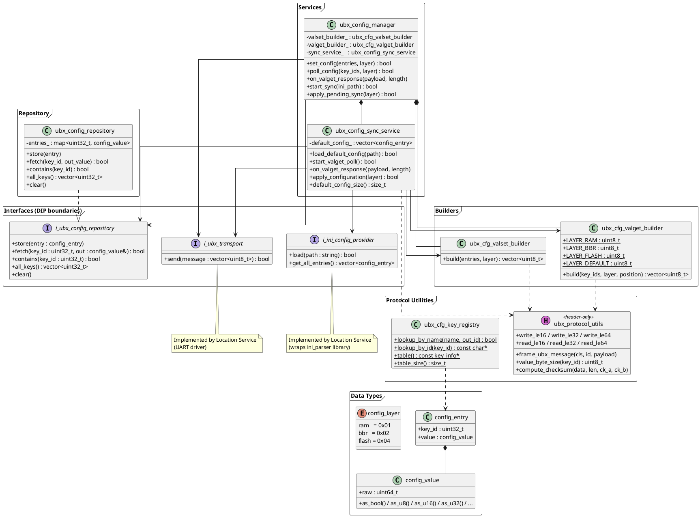
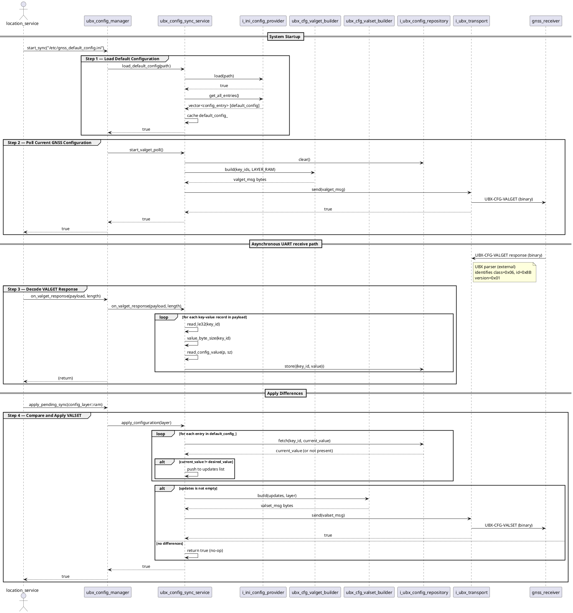

# UBX Configuration Library

A **C++14** GNSS configuration subsystem for u-blox receivers running on embedded Linux (automotive).

Implements the UBX **CFG-VALGET** / **CFG-VALSET** binary protocol with SOLID architecture and strict little-endian serialisation.

---

## Directory Structure

```
ubx_config/
├── ubx_config_key.h              — All official key IDs (imported from u-blox ubxlib)
├── ubx_config_types.h            — config_value, config_entry, config_layer
├── ubx_protocol_utils.h          — Header-only LE serialisation + UBX framing
│
├── i_ubx_transport.h             — Interface: send bytes over UART
├── i_ini_config_provider.h       — Interface: load default config from INI file
├── i_ubx_config_repository.h     — Interface: store/fetch current GNSS config
│
├── ubx_cfg_valset_builder.h/cpp  — Build VALSET binary messages
├── ubx_cfg_valget_builder.h/cpp  — Build VALGET poll requests
├── ubx_config_repository.h/cpp   — In-memory implementation of the repository
├── ubx_cfg_key_registry.h/cpp    — String-name ↔ key-ID lookup table
├── ubx_config_sync_service.h/cpp — 4-step config synchronisation logic
├── ubx_config_manager.h/cpp      — Public API facade
│
├── example_usage.cpp             — Stub-based integration example
└── Makefile
```

---

## Architecture

### Component Responsibilities

| Component | Role |
|---|---|
| `ubx_config_manager` | Public API — set, poll, sync |
| `ubx_config_sync_service` | 4-step sync protocol state machine |
| `ubx_cfg_valset_builder` | Serialise VALSET payload (little-endian) |
| `ubx_cfg_valget_builder` | Serialise VALGET payload |
| `ubx_config_repository` | In-memory current-state cache |
| `ubx_cfg_key_registry` | Name → key-ID lookup table |
| `i_ubx_transport` | Abstracts UART send |
| `i_ini_config_provider` | Abstracts INI file parsing |
| `i_ubx_config_repository` | Abstracts repository storage |

---

## Synchronisation Flow

```
1. load_default_config(ini_path)
      → i_ini_config_provider::load()
      → cache default config_entry list

2. start_valget_poll()
      → build VALGET message for all default-config keys
      → i_ubx_transport::send()

3. on_valget_response(payload, length)            ← called by UBX parser
      → decode LE key-value pairs from payload
      → store in i_ubx_config_repository

4. apply_configuration(layer)
      → for each default key: compare repo value vs default value
      → if different: add to update list
      → build single VALSET message
      → i_ubx_transport::send()
```

---

## Build

```bash
make             # builds libubx_config.a
make example     # builds example_usage binary
make clean
```

---

## UBX Protocol Notes

- All multi-byte values in VALGET / VALSET payloads are **little-endian**.
- Key ID bits 27-24 encode value size: `1`/`2`→1 byte, `3`→2 bytes, `4`→4 bytes, `5`→8 bytes.
- VALSET layers: `RAM=0x01`, `BBR=0x02`, `FLASH=0x04` (combinable as bit flags).
- VALGET response version byte = `0x01`; poll request version = `0x00`.

---

## Architecture Diagrams (PlantUML)

### 1. Static View — Class Diagram



---

### 2. Dynamic View — Synchronisation Sequence Diagram



---

## Example Configuration File (`/etc/gnss_default_config.ini`)

```ini
[gnss]
; Measurement rate in milliseconds
rate_meas=1000

; Dynamic platform model: 6 = automotive
navspg_dynmodel=6

; Enable UBX-NAV-PVT output on UART1
msgout_ubx_nav_pvt_uart1=1

; Enable GPS constellation
signal_gps_ena=1
signal_gps_l1ca_ena=1
signal_gps_l2c_ena=1
```

> Key names must match the snake_case identifiers in `ubx_config_key.h`.
> The INI adapter implementation uses `ubx_cfg_key_registry::lookup_by_name()`
> to resolve each name to its numeric key ID.